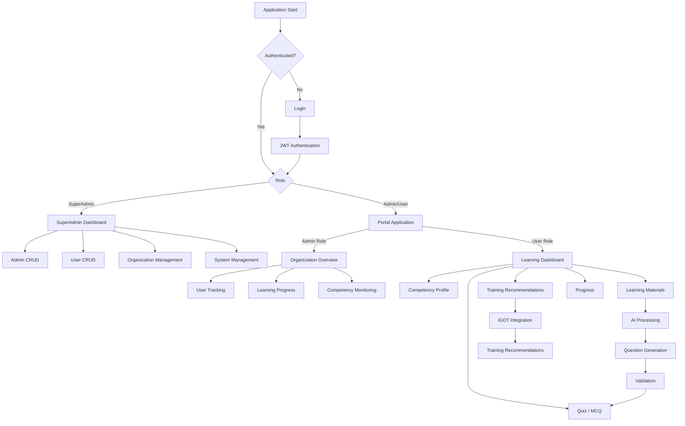
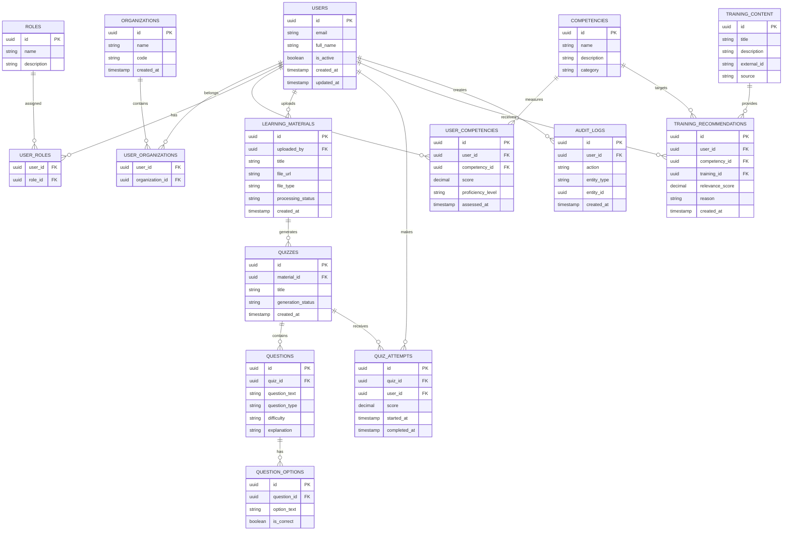

# SAMARTH — SYSTEM ARCHITECTURE & DATA BLUEPRINT

## 0. PROJECT ROOT

The current working directory is the Samarth project root.

```text
. = Samarth/
```

Never create:

```text
./Samarth/
```

All paths are relative to:

```text
./
```

---

# 1. REPOSITORY STRUCTURE

```text
.
│
├── AI/
│   ├── 1_ai_rules.md
│   ├── 2_architecture.md
│   └── 3_active_state.md
│
├── Client/
│   ├── SuperAdmin/
│   └── Portal/
│
├── Server/
│
├── Database/
│
├── Docs/
│
├── .gitignore
├── .gitattributes
└── LICENSE
```

---

# 2. APPLICATION ARCHITECTURE

Samarth consists of two frontend applications and one shared backend.

```text
                         SAMARTH
                            │
              ┌─────────────┴─────────────┐
              │                           │
              ▼                           ▼
         SuperAdmin                    Portal
         Client App                  Client App
              │                           │
              └─────────────┬─────────────┘
                            │
                            ▼
                       FastAPI Server
                            │
            ┌───────────────┼───────────────┐
            │               │               │
            ▼               ▼               ▼
        Supabase           AI             iGOT
        PostgreSQL       Services       Integration
```

---

# 3. CURRENT VS PLANNED

## Currently Prioritized

```text
SuperAdmin
Server
Database
AI context
```

## Planned

```text
Portal (Admin & User)
Advanced competency system
Personalized recommendations
Advanced AI learning workflows
Full iGOT integration
```

Do not represent planned functionality as completed functionality.

---

# 4. SUPERADMIN

SuperAdmin is the current administrative frontend.

Primary responsibilities:

```text
Admin CRUD
User CRUD
System-level management
Basic organizational administration
```

Final SuperAdmin requirements:

```text
[FILL IN]
```

---

# 5. PORTAL

Portal is the planned application for the organization members. It uses Role-Based Access Control (RBAC) to determine if the logged in member is an Admin (Headmaster) or a User (Teacher).

Admin Role (Organization-scoped authority):
- Manage organization-level learning activities.
- Track User progress and monitor competency gaps.

User Role (Teacher/member):
- View learning profile and competencies.
- Complete assessments, take quizzes/MCQs.
- Receive training recommendations.

Final responsibilities:

```text
[FILL IN]
```

---

# 7. HIGH-LEVEL DATA FLOW

```text
User
  │
  ▼
Client Application
  │
  │ Axios / HTTPS
  ▼
FastAPI
  │
  ├──────────────► Authentication / Authorization
  │
  ├──────────────► Application Services
  │                     │
  │                     ├── Competency
  │                     ├── Learning
  │                     ├── Quiz
  │                     └── AI
  │
  ├──────────────► Supabase PostgreSQL
  │
  └──────────────► iGOT Karmayogi
```

---

# 8. AUTHENTICATION FLOW

Initial design:

```text
Client
  │
  ▼
Login
  │
  ▼
FastAPI
  │
  ▼
Credential Validation
  │
  ▼
JWT
  │
  ▼
Client
  │
  ▼
Axios Authorization
  │
  ▼
Protected FastAPI Endpoint
```

Final authentication storage strategy:

```text
[FILL IN: HttpOnly cookie / approved strategy]
```

---

# 9. AUTHORIZATION

Initial role hierarchy:

```text
SuperAdmin
    │
    ├── Admin
    │     │
    │     └── User
    │
    └── Platform-level control
```

Important:

```text
SuperAdmin ≠ Admin ≠ User
```

Admin/User access must be organization-scoped.

Final RBAC:

```text
[FILL IN: Final permissions matrix]
```

---

# 10. SCREEN FLOW



Final screen flow:

```text
[FILL IN: Approved screen flow]
```

---

# 11. COMPETENCY GAP FLOW

```text
User Data
   +
Assessment Results
   +
Learning History
   +
Competency Framework
        │
        ▼
Competency Evaluation
        │
        ▼
Current Proficiency
        │
        ▼
Target Proficiency
        │
        ▼
Competency Gap
        │
        ▼
Training Recommendation
        │
        ▼
Learning
        │
        ▼
Reassessment
```

Final competency methodology:

```text
[FILL IN]
```

---

# 12. AI LEARNING MATERIAL FLOW

```text
Upload Material
       │
       ▼
File Validation
       │
       ▼
Text Extraction
       │
       ▼
Content Processing
       │
       ▼
AI Context Construction
       │
       ▼
Question Generation
       │
       ▼
Structured Output Validation
       │
       ▼
Quality Validation
       │
       ▼
Review
       │
       ▼
Quiz Publication
```

Supported formats:

```text
[FILL IN: PDF]
[FILL IN: DOCX]
[FILL IN: PPTX]
[FILL IN: TXT]
[FILL IN: Other]
```

---

# 13. DATABASE — INITIAL CONCEPT

The database schema is intentionally provisional.



Final schema:

```text
[FILL IN: Approved Supabase schema]
```

---

# 14. SERVER STRUCTURE

```text
./Server/
│
├── app/
│   ├── main.py
│   │
│   ├── api/
│   │   └── routes/
│   │
│   ├── core/
│   │   ├── config.py
│   │   ├── security.py
│   │   └── dependencies.py
│   │
│   ├── models/
│   ├── schemas/
│   │
│   ├── services/
│   │   ├── auth/
│   │   ├── ai/
│   │   ├── competency/
│   │   ├── learning/
│   │   ├── quiz/
│   │   └── igot/
│   │
│   ├── repositories/
│   └── utils/
│
├── tests/
├── requirements.txt
└── .env.example
```

---

# 15. CLIENT STRUCTURE

```text
./Client/
│
├── SuperAdmin/
│
└── Portal/
```

Each frontend is an independent React/Vite application.

Common baseline:

```text
React
Vite
Axios
Tailwind CSS
Lucide React
```

---

# 16. DATABASE STRUCTURE

```text
./Database/
│
├── migrations/
├── schema/
├── seeds/
├── functions/
└── policies/
```

Final database tooling:

```text
[FILL IN]
```

---

# 17. API STRUCTURE

Initial grouping:

```text
/api/v1/auth
/api/v1/users
/api/v1/roles
/api/v1/organizations
/api/v1/competencies
/api/v1/learning
/api/v1/recommendations
/api/v1/materials
/api/v1/quizzes
/api/v1/questions
/api/v1/assessments
/api/v1/analytics
/api/v1/igot
/api/v1/admin
/api/v1/audit
```

Final API contract:

```text
[FILL IN]
```

---

# 18. iGOT INTEGRATION

Initial conceptual flow:

```text
Samarth
   │
   ▼
iGOT Karmayogi
   │
   ├── Courses
   ├── Learning Resources
   ├── Learning Status
   └── Training Data
```

Integration mechanism:

```text
[FILL IN: API / OAuth / SSO / other]
```

Final API documentation:

```text
[FILL IN]
```

---

# 19. PENDING ARCHITECTURE

```text
[FILL IN: Final requirements]

[FILL IN: Final RBAC]

[FILL IN: Final organization model]

[FILL IN: Final database schema]

[FILL IN: API contracts]

[FILL IN: AI architecture]

[FILL IN: AI provider/model]

[FILL IN: iGOT integration]

[FILL IN: File processing]

[FILL IN: Deployment]

[FILL IN: CI/CD]

[FILL IN: Monitoring]

[FILL IN: Testing]

[FILL IN: Security]

[FILL IN: Performance]

[FILL IN: Scalability]
```
